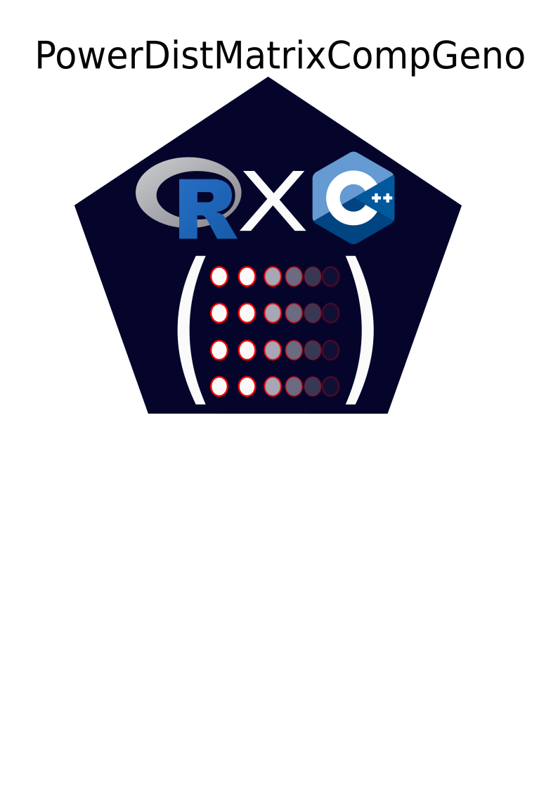

# GENOtyping by POWerful DIstance Matrix in C++ </a>

## Introduction:
This package main purpose is to make genotyping microsatellite data, a process that can easily take days to weeks according to the number of loci and individuals, but making it almost instantaneous by utulizing the power of C++ for distance matrix calculation.

In this package is included, 
* A genotype assignment function
* A genotype discovery curve computation with bootstraps
* Probability of identity (adapted from Paetkau and Strobeck (1994)) -> in progress

## Getting started: 

## how to cite:
If you use, please cite the accompagning paper : Brejon Lamartinière et al, 
